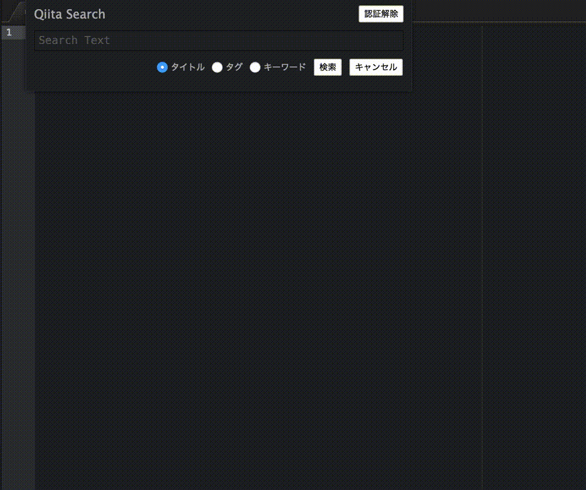
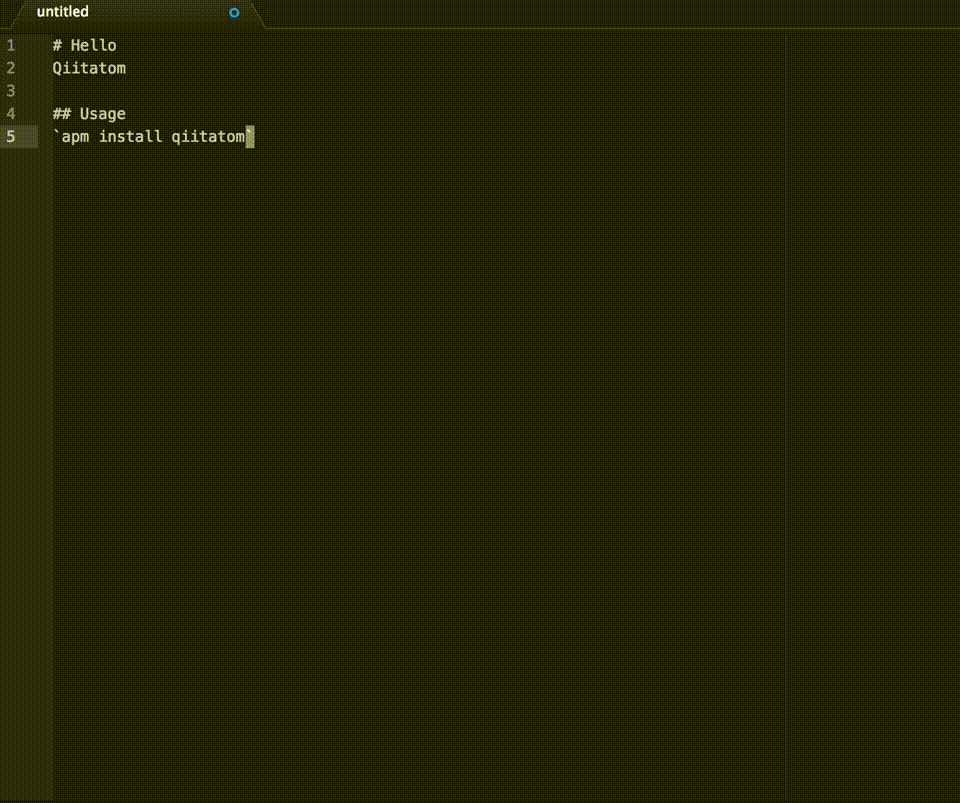

# Qiitatom
Qiita search/view/post client for atom editor.
 - Search posts from Qiita by title, tags or keyword.
 - Post your editing file to Qiita with preview.

## Search posts by (title|tags|keyword)


## Post markdown in your editor


## Usage
Type `Qiitatom:Search` or `Qiitatom:Post` in your command pallet.

<b>NOTICE:</b> You need create access token at qiita my page. You can access that page from search/post panel.

## Installation
```
$ apm install qiitatom
```
